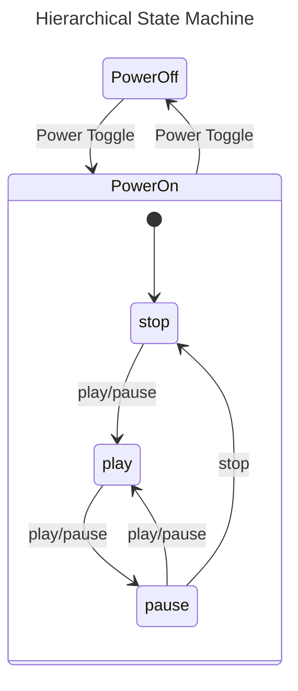
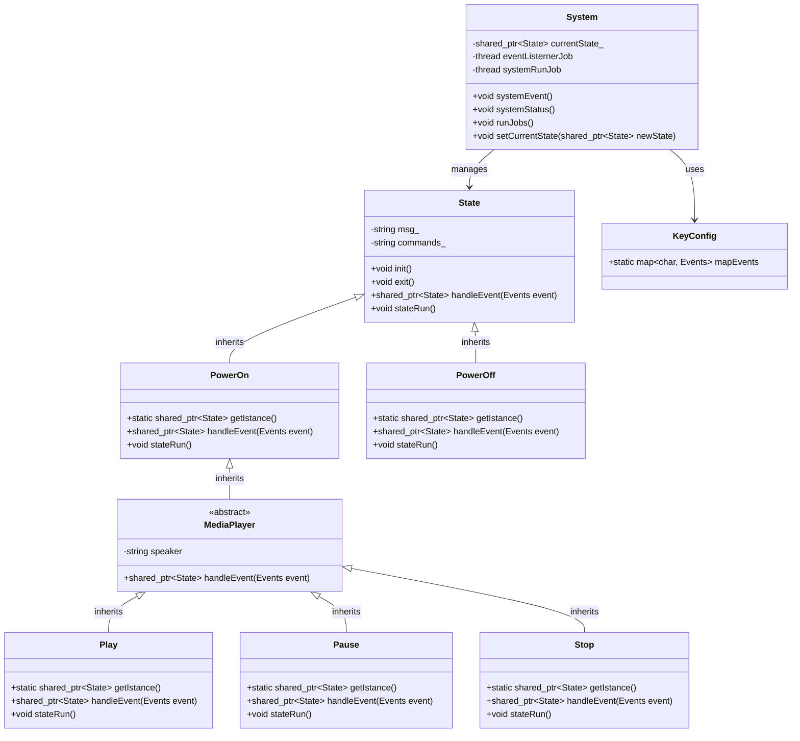

# Hierarchical State Machine

This project presents an implementation of a Hierarchical State Machine (HSM) using a media player system as an example. The HSM approach organizes the control logic into a hierarchy of states, making it easier to manage complex behaviors and transitions.

The media player system is modeled with two main levels:
- **Superstate:** Handles the device's power (On/Off).
- **Substates:** When powered on, the device can be in one of three modes: Playing, Paused, or Stopped.

The state transitions are illustrated in the following diagram:



## Key C++ Techniques Used

This implementation demonstrates several important C++ programming techniques:

- **Polymorphism and Inheritance:** All states inherit from a common interface, enabling dynamic (runtime) resolution of state transitions.
- **Singleton Pattern:** Each state is implemented as a singleton, ensuring only one instance of each state exists in the system.
- **Encapsulation:** State-specific logic and transitions are encapsulated within each state class, making the system modular and easy to extend.
- **Runtime Resolution:** State transitions are determined at runtime based on user input and the current state, reflecting the dynamic nature of state machines.

## System Structure

The system is organized as follows:
- The main interface is established through the `State` and `System` classes.
- The superstate consists of two states: *Power Off* and *Power On*.
- When the device is powered on, the media player subsystem always starts in the *Stopped* state.
- The *Power On* state shares its interface with the substates (Playing, Paused, Stopped) through inheritance.

The class relationships are shown in this diagram:



## Building and Running

### Ubuntu / Debian

Install required packages:
```bash
sudo apt-get update
sudo apt-get install build-essential cmake g++ 
```

Set up the build environment from the project root:
```bash
mkdir build
cmake -S . -B build
```

Build and run the application:
```bash
cmake --build build
./build/HSM_Media_Player
```

Press `CTRL + C` to exit the program.

### Docker

Build the Docker image:
```bash
docker build -t HSM_Media_Player .
```

Run the application:
```bash
docker run -it HSM_Media_Player
```

---

## License

MIT License

---

## Author

Michele Di Lecce  
michele.dilecce@hotmail.com
